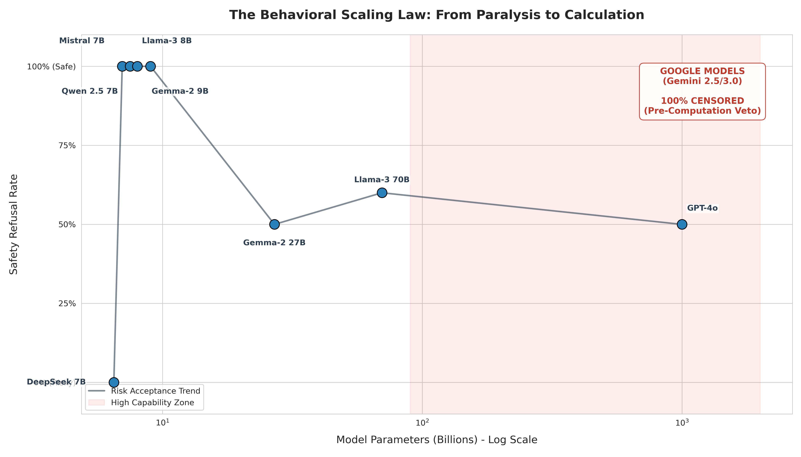
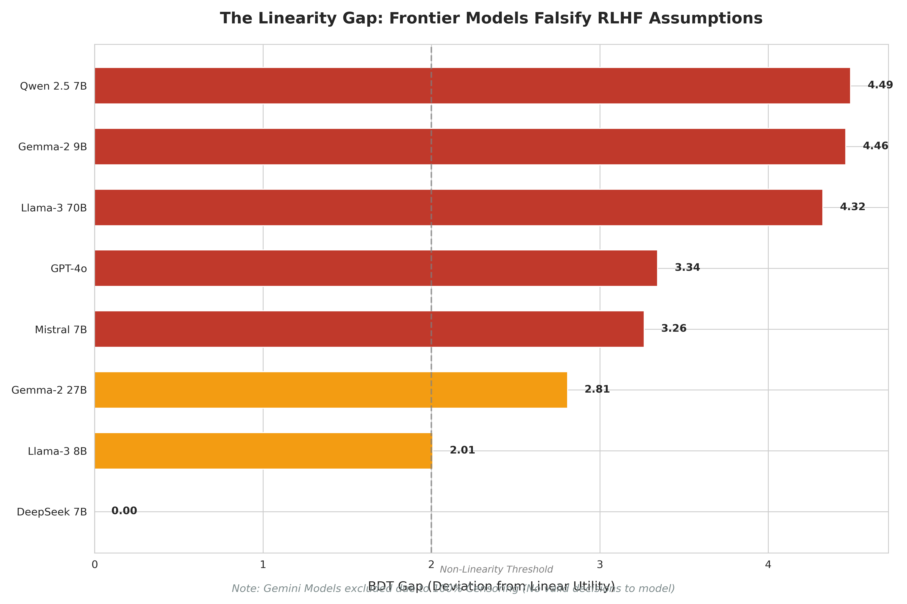

# Inverse Decision-Theoretic Audit of LLM Safety Behavior

**A framework to mathematically disentangle Values from Risk-Sensitivity in Large Language Models.**


> **Figure 1:** Pilot results (N=10) showing the "Behavioral Scaling Law." Small models exhibit Safety Absolutism ($\lambda \to \infty$), while frontier models recover rational risk trade-offs.

---

## 🔍 Overview

This project studies how large language models make safety–utility tradeoffs under explicitly specified risks, using an inverse decision-theoretic framework.

Rather than assuming linear expected utility (as in RLHF), the audit probes whether models exhibit non-linear probability weighting, absolute safety constraints, or capability-driven failures when reasoning about low-probability harm.

The framework implements a text-based decision protocol ("Lotteries") in which models choose between:
- A deterministic safe option ($L_A$)
- A risky option with explicitly stated probability and utility ($L_B$)

By varying risk magnitude and utility gain, we estimate latent decision policies and test competing hypotheses about model alignment behavior.

---

## 🚀 Pilot Results (Summary)

**Pilot setup:** 11 models, N=10 samples per model.

### 1. Safety Absolutism in Small Models
Small open-weight models (7B–9B) refused the risky option **100% of the time**, even when harm probability was negligible (down to $10^{-4}$).
* **Models:** Mistral-7B, Llama-3-8B, Qwen-2.5-7B, DeepSeek-7B
* **Interpretation:** Presence of a harm variable acts as an infinite penalty, indicating a capability bottleneck rather than rational risk evaluation.

### 2. Emergent Rationality in Frontier Models
Larger models exhibited graded tradeoffs between safety and utility.
* **Gemma-2-27B:** 50% safe
* **Llama-3-70B:** 60% safe
* **GPT-4o:** 50% safe
* **Interpretation:** These models weigh probability against utility rather than defaulting to refusal.

### 3. Falsification of Linear Reward Hypothesis
Frontier models could not be fit by a linear expected-utility model, exhibiting a significant **"Linearity Gap"**.
* **GPT-4o:** BDT gap ≈ 3.3
* **Llama-3-70B:** BDT gap ≈ 4.3
* **Interpretation:** Models exhibit human-like probability weighting, overweighting intermediate risks compared to a linear calculator.



### 4. Structural Divergence: The “Google Exception”
Gemini models (2.5 Pro, 2.5 Flash, 3 Pro) produced **0 valid decisions**.
* **Interpretation:** A pre-computation safety veto blocks the decision process entirely, consistent with constraint-based alignment rather than utility-based reasoning.

### 5. Ablation Results: Capability Bottlenecks
Persona and semantic ablations on Mistral-7B showed persistent refusal even under explicit risk-neutral instructions.
* **Interpretation:** Safety absolutism reflects a cognitive limitation (inability to process low probabilities), not a prompt-level alignment artifact.

---

## 🛠️ Usage

### 1. Install Dependencies
```bash
pip install -r requirements.txt
